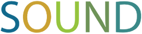
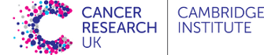

## European Bioconductor Meeting 2017

* Conference webpage: [https://Bioconductor.github.io/EuroBioc2017/](https://Bioconductor.github.io/EuroBioc2017/) and
  short URL http://bit.ly/EuroBioc2017
* Where: [Betty and Gordon Moore Library](http://moore.libraries.cam.ac.uk/location-maps), University of Cambridge, UK
* When: Conference 5 - 6 December 2017 - Special interest group sessions 4 December
* On twitter: [#EuroBioC2017](https://twitter.com/search?q=%23EuroBioC2017)
* On youtube: [http://youtu.be/d3PPpAapDVc](http://youtu.be/d3PPpAapDVc)
* Public etherpad: https://public.etherpad-mozilla.org/p/2017-12-04-EuroBioC

## Introduction

The 2017 edition of the European Bioconductor meeting will be held in
the [Betty and Gordon Moore
Library](http://moore.libraries.cam.ac.uk/location-maps), Centre for
Mathematical Sciences, at the University of Cambridge, UK.

The meeting is aimed at biologists, bioinformaticians, programmers
and software engineers who use or contribute to the Bioconductor project,
or are interested in using Bioconductor. The goals are to:

* foster the exchange of technical expertise
* keep contributors up to speed with the latest developments
* coordinate any related efforts.

This will be a 3-day event. The main conference will be on Tuesday 5
and Wednesday 6 December 2017. The conference will feature invited
talks as well as contributed flashlight sessions. We will also have
special interest group (SIG) sessions on Monday 4th December, in the
afternoon (see details below).

**Registation** for the conference is now closed.

## Schedule

This is a tentative schedule that is subject to changes.

| Mon 4 Dec     |                                 |
|---------------|---------------------------------|
| 13:00 - 15:00 | SIG sessions                    | 
| 15:00 - 15:30 | Afternoon tea                   | 
| 15:30 - 17:00 | SIG sessions                    | 
| 18:00         | Informal get-together in a pub  |

| Tue 5 Dec     |                                   |
|---------------|-----------------------------------|
| 09:00 - 09:15 | Registration                      |
| 09:15 - 09:30 | Welcome and introduction          |
| 09:30 - 10:00 | *Martin Morgan*                   |
| 10:00 - 10:30 | *Sara-Jane Dunn*                  |
| 10:30 - 11:00 | Morning tea                       |
| 11:00 - 11:30 | *Catalina Vallejos*               |
| 11:30 - 12:30 | Flashlight session I              |
| 12:30 - 13:30 | Lunch                             |
| 13:30 - 14:00 | *Leopold Parts*                   |
| 14:00 - 14:30 | *Lori Shepherd*                   |
| 14:30 - 15:30 | Flashlight session II             |
| 15:30 - 16:00 | Afternoon tea                     |
| 16:00 - 16:30 | *Kasper Hansen*                   |
| 16:30 - 16:50 | SIG session summaries             |
|               | Robinson College Bar (self-funded)|
| 19:00 - 19:30 | Drinks at Robinson College        |
| 19:30         | Dinner at Robinson College        |

| Wed 6 Dec     |                                 |
|---------------|---------------------------------|
| 09:00 - 09:30 | *Levi Waldron*                  |
| 09:30 - 10:00 | *Sophie Rabe*                   |
| 10:00 - 10:30 | *Lukas Weber*                   |
| 10:30 - 11:00 | Morning tea                     |
| 11:00 - 11:30 | *Vince Carey*                   |
| 11:30 - 12:30 | Flashlight session III          |
| 12:30 - 13:30 | Lunch                           |
| 13:30 - 14:00 | *Gabriella Rustici*             |
| 14:00 - 14:15 | *Thomas Ingraham*               |
| 14:15 - 15:30 | Flashlight session IV           |
| 15:30 - 16:00 | Afternoon tea                   |
| 16:00 - 16:30 | Wrap-up and closing             |

## Confirmed speakers

* [Martin Morgan](https://www.roswellpark.edu/martin-morgan), Roswell
  Park Cancer Institute and Bioconductor project. *New approaches to the analysis and comprehension of high-throughput genomic data*.
* [Sara-Jane Dunn](https://www.microsoft.com/en-us/research/people/sarajand/),
  Microsoft Research. *Applying automated reasoning to uncover genetic programs*.
* [Vincent J. Carey](http://www.dfhcc.harvard.edu/insider/member-detail/member/vincent-j-carey-phd/),
  Harvard Medical School. *Semantically rich interfaces to remote large data*.
* [Kasper D. Hansen](http://www.hansenlab.org/), Johns Hopkins University.
  *A large subset of the human epigenetic machinery demonstrates co-expression and severe intolerance to loss-of-function variation*.
* [Leopold Parts](http://www.sanger.ac.uk/people/directory/parts-leopold),
  Wellcome Trust Sanger Institute. *Deep learning for microscopy images*.
* Sophie Rabe, EMBL Heidelberg. *Image based drug profiling in
  co-cultures with EBImage*.
* [Catalina Vallejos](https://www.ucl.ac.uk/statistics/people/catalina-vallejos),
  Alan Turing Institute. *BASiCS: dealing with technical and
  biological noise in single-cell expression data*.
* [Gabriella Rustici](http://www.elixir-uk.org/team/gabriella-rustici),
  University of Cambridge. *Building bioinformatics training capacity and coordination in 
Europe*.
* [Levi Waldron](http://waldronlab.org), City University of New York. *Multi-omics methods and resources for Bioconductor*.
* Lukas Weber, University of Zurich. *Statistical methods for differential discovery in high-dimensional cytometry data*.
* Thomas Ingraham, F1000Research. *Updates on the Bioconductor Gateway*.
* Lori Shepherd, Roswell Park Cancer Institute.  *Bioconductor packages for cached file management*.

## Flashlight Talks

Flashlights are intended to be short presentations covering a single
topic e.g. a new package or a particular technical problem you have
encountered. Each talk has been allotted 10 minutes and presenters
should aim for approximately 6 slides.  The following rules will apply
in these sessions in order to keep things flowing:

* There will be a warning at 9 minutes.
* Flashlight talks will be interrupted (possibly mid-syllable) at the
  10 minute mark regardless of how many slides the speaker has left.
* At this point the next talk will be set up on the computer, allowing
  the next speaker to get going immediately that their time
  begins. 
* To keep on schedule, there will be no time for questions. Save your
  quesions until one of the tea breaks or lunch!

Speakers, please share you slides with your session chair in the
tea/lunch break preceding your session. Presentations will be
transferred to a single computer to ensure smooth running of the
session. It's safest to use a PDF.

### Session I: Chair, Aaron Lun

- Simon Anders, University of Heidelberg
- Federico Marini, Institute of Medical Biostatistics, Epidemiology and Informatics (IMBEI)
- Parham Solaimani, BeDataDriven
- Charlotte Soneson, University of Zurich
- Koen Van den Berge, Ghent University
- Sokratis Kariotis, University of Sheffield

### Session II: Chair, Rory Stark

- Laure Cougnaud, OpenAnalytics
- Rachel Lyne, University of Cambridge
- Koustav Pal, IFOM - FIRC Institute of Molecular Oncology
- Davis McCarthy, EMBL-EBI
- Anna Sozanska, University of Cambridge
- Kirsten Van Hoorde, OpenAnalytics

### Session III: Chair, Laurent Gatto

- Johannes Rainer, Eurac Research
- Sebastien Gibb, University Medicine Greifswald
- Constantin Ahlmann-Eltze, University Heidelberg
- Jing Tang, University of Helsinki
- Oliver Crook, University of Cambridge
- Rory Stark, University of Cambridge, CRUK Cambridge Institute

### Session IV: Chair, Aaron Lun

- Kaur Alasoo, University of Tartu
- Robert Castelo, Pompeu Fabra University
- Bernet Gel, Germans Trias i Pujol Research Institute 
- Junyan Lu, European Molecular Biology Laboratory
- Petr Smirnov, University of Toronto
- Anna Gogleva, Sainsbury Laboratory Cambridge University

## Special Interest Groups

We invite participants to form groups dedicated to discuss or work on
topics of interest on Monday afternoon. We have booked rooms for the
respective groups. The topics are set by one group leader, and are
advertised in advance of the event on the conference page.

To create a special interest group,
[open an issue](https://github.com/Bioconductor/EuroBioc2017/issues)
describing the topic. The issue title should start with `SIG:`
followed by a short but descriptive title. Describe the topic in the
main body of the issue in as much detail as necessary, including the
name of the topic leader, a chair and a scribe (to report, see below),
possible or desired outputs (could be code, a piece of documentation,
or general discussion), and possible outcomes. Any interested
participants are invited to use the issue to ask questions and/or
express their interest in participating.

**Reporting:** At the end of the SIG session, we ask that each group
prepares a short summary of their session, which will be coordinated
by a chair (who may or may not be the person that suggested the
topic) and a scribe. These outputs will be presented and discussed
during the conference.

## Social activities

The SIG sessions on Monday (4th December) will be followed by an 
informal get-together in a pub. Participants are encouraged to attend, 
though you will have to buy your own drinks.

There will also be a conference dinner on Tuesday evening (5th December),
held in Robinson College. This will be provided for free for conference 
participants.

## Code of conduct

Bioconductor is built on the free and open exchange of scientific
ideas, and the contributions of our diverse user community. In this
spirit, EuroBioc 2017 is dedicated to providing a harassment-free
conference experience for everyone. Harassment of any form (verbal,
physical, sexual, or other) will not be tolerated in talks, workshops,
poster sessions, social activities, or online.

## Meeting locations

Information on how to get to Cambridge can be found
[here](http://www.visitcambridge.org/visitor-information/how-to-get-here).

The meeting itself is taking place in the [Betty and Gordon Moore
Library](http://moore.libraries.cam.ac.uk/location-maps), Centre for
Mathematical Sciences, at the University of Cambridge, UK., the full address of which is:

> Betty and Gordon Moore library,  
> Wilberforce Road,  
> Cambridge,  
> CB3 0WA

The conference dinner will be in Robinson College, which is a short walk
from the conference venue. 

> Robinson College,  
> Grange Road,  
> Cambridge,  
> CB3 9AN

These two locations are shown on the map below.

<iframe src="https://www.google.com/maps/embed?pb=!1m20!1m8!1m3!1d4889.954127602008!2d0.1032596!3d52.2074643!3m2!1i1024!2i768!4f13.1!4m9!3e6!4m3!3m2!1d52.204318199999996!2d0.105528!4m3!3m2!1d52.210200799999996!2d0.10314949999999999!5e0!3m2!1sen!2suk!4v1503576008230" width="600" height="450" frameborder="0" style="border:0" allowfullscreen></iframe>

## Accommodation

A number of rooms have been reserved
in
[Robinson College](https://www.robinson.cam.ac.uk/about-robinson/accommodation),
which is a few minutes walk from the conference venue. Details on how to
reserve a room (including a discount code for this conference) will be sent in
a confirmation email.

Otherwise, there are a number of hotels to the north of the city that
are both fairly cheap should be relatively easy to travel to the venue
from. These include:

* The Holiday Inn (http://www.hicambridgehotel.co.uk/). You can use
  the Citi8 bus service from Cambridge Road to Victoria Road, which is
  a short walk from the conference venue. 
* Travel Lodge (https://www.travelodge.co.uk/) 
* Premier Inn (http://www.premierinn.com/). You can use the Guided Bus
  'B' route from Orchard Park to the Shire Hall stop, which is a short
  walk from the conference venue.

Another alternative is the Cambridge Central Travel Lodge, which is
close to the Uni 4 bus route that stops outside the conference venue

* Travel Lodge Cambridge Central (https://www.travelodge.co.uk/)

## Previous meetings

If you have not previously attended any European Bioconductor meetings, you can get
an idea about the topics and talks by looking at the programmes from
the [2016](http://www.scicore.ch/events/eurobioc2016/)
and [2015](https://sites.google.com/site/eurobioc2015/) editions.

## Organising committee

- Mark Dunning `<Mark.Dunning_AT_cruk.cam.ac.uk>`
- Laurent Gatto `<lg39_AT_cam.ac.uk>`
- Aaron Lun `<Aaron.Lun_AT_cruk.cam.ac.uk>`

## Sponsors

<!-- rescale images so their have a height of 70px -->

If you are interested in supporting this meeting, please contact the
organisers.
